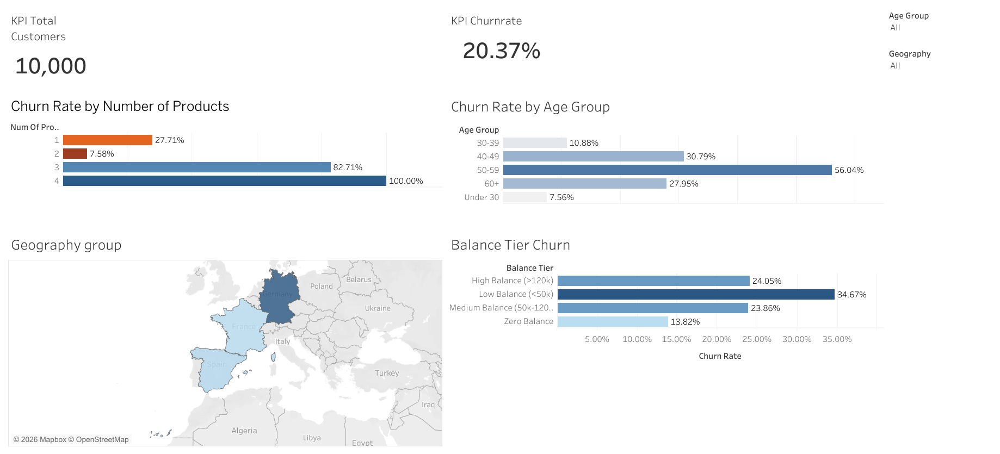

# 🏦 Bank Customer Churn & Risk Analysis

## 📌 Executive Summary
Customer attrition poses a critical revenue risk for retail banking services. This project presents an end-to-end diagnostic analysis of **10,000 customer records** to identify key drivers of customer churn. By engineering custom metrics and feature tiers in SQL and developing an interactive Tableau dashboard, this project delivers actionable business recommendations to mitigate customer loss.

🔗 Interactive Tableau Dashboard:

https://public.tableau.com/app/profile/syed.shaheer.ali/viz/Projectdashboard_17847251138120/Dashboard1?publish=yes

---

## 📊 Key Business Findings

1. **Age Risk Spikes (50–59 Bracket):**
   * While customers under 30 exhibit low churn rates (**5.20%**), churn escalates rapidly in middle-aged demographics, reaching a massive **56.04% peak** among customers aged 50–59.
2. **Product Overload Anomaly:**
   * Holding **2 products** represents the optimal customer retention sweet spot (**7.58% churn**).
   * Customers holding **3 products** experience **82.71% churn**, while holding **4 products** results in a **100% churn rate**, indicating flawed multi-product cross-selling or severe bundle fatigue.
3. **Geographic Variance (Germany):**
   * Customers in **Germany** exhibit a **32.44% churn rate**, nearly double the attrition rates observed in France (**16.15%**) and Spain (**16.67%**).
4. **Balance Impact:**
   * Low-balance accounts (<50k) exhibit elevated churn rates (**48.78%**), demonstrating that low-engagement accounts require targeted retention incentives.

---

## 🛠️ Data Stack & Methodology

* **Data Extraction & SQL Feature Engineering:** SQLite, Python (`sqlite3`, `pandas`)
  * Created `vw_churn_analysis` SQL view to engineer `Age_Group` and `Balance_Tier` classifications.
* **Data Visualization:** Tableau Public
  * Built interactive cross-filtering dashboards featuring KPI metric summary cards, dynamic map views, and categorical breakdown bar charts.
* **Documentation & Repository:** Jupyter Notebook, Git, GitHub.

---

## 💡 Strategic Recommendations

1. **Targeted Retention for Demographics 45–60:** Deploy proactive account management services, personalized wealth transition products, and loyalty incentives for customers entering their peak churn years.
2. **Audit Multi-Product Cross-Selling:** Immediately investigate the 4-product customer experience. Re-evaluate auto-enrollment bundles to ensure products add genuine financial utility rather than fee confusion.
3. **Germany Market Strategy Review:** Conduct localized customer satisfaction audits in the German market to diagnose localized service, regulatory, or competitive pressures causing elevated churn.

---

## 📁 Repository Structure
```text
├── data/                # Database and processed CSV extracts
├── notebooks/           # Jupyter Notebook with cleaning & SQL queries
├── sql/                 # SQL script definitions and views
└── README.md            # Executive project documentation
